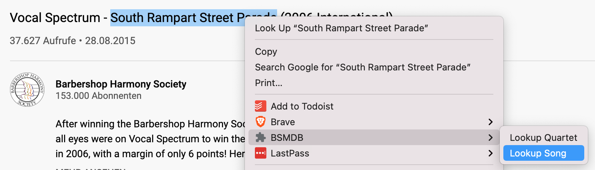
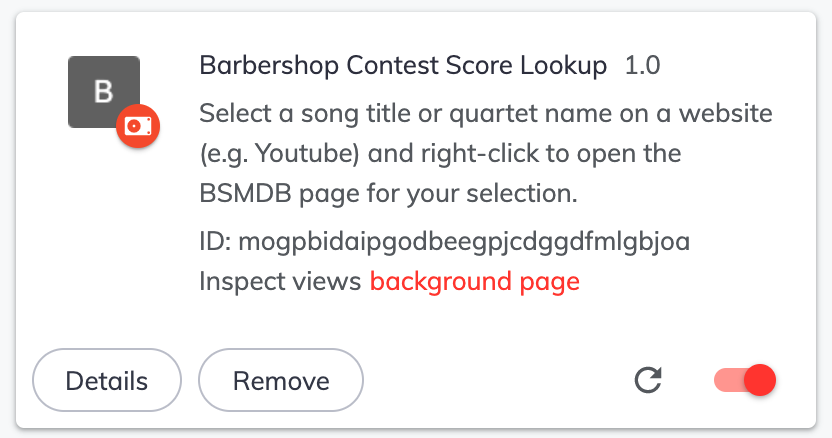

# BSMDB Lookup Extension for Chrome

This is a Chrome extension that allows you to look up barbershop contest scores on [bsmdb.net](http://www.bsmdb.net/).

## Usage

In your Chrome browser, mark some text with your mouse. Then right-click on that text and click on "BSMDB". 

In the submenu that opens, choose either "Lookup Song" to look up your marked text as a song title, or "Lookup Quartet" to look up your marked text as a quartet name. A new tab with search results on bsmdb.net will open, and you can look up contest scores as usual.

## Installation

I haven't had a chance to make an official release of this extension that you could install from the Chrome web store. For now, proceed as follows.

1. Download the [Zip file](https://github.com/alexanderkoller/bsmdb-lookup-extension/releases/download/1.0/bsmdb-lookup-extension.zip) with the extension.
2. Unzip the zip file. This creates a directory called "bsmdb-lookup-extension".
3. Follow [these instructions on how to install an unpacked extension in Chrome](https://webkul.com/blog/how-to-install-the-unpacked-extension-in-chrome/). Where the instructions say "select your Unzip folder", choose your "bsmdb-lookup-extension" directory.

The extension should now be installed and look like this on your Extensions page:

Go to your favorite website, e.g. Youtube, and try the extension out.

